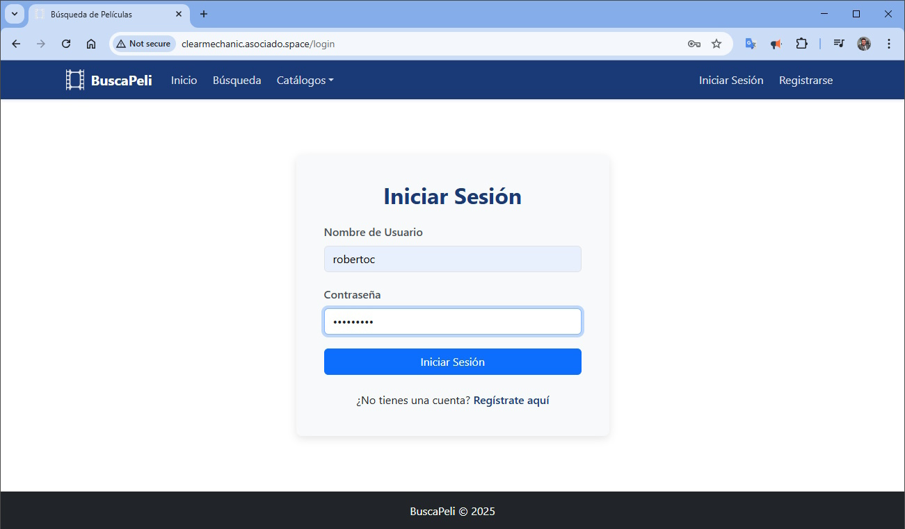
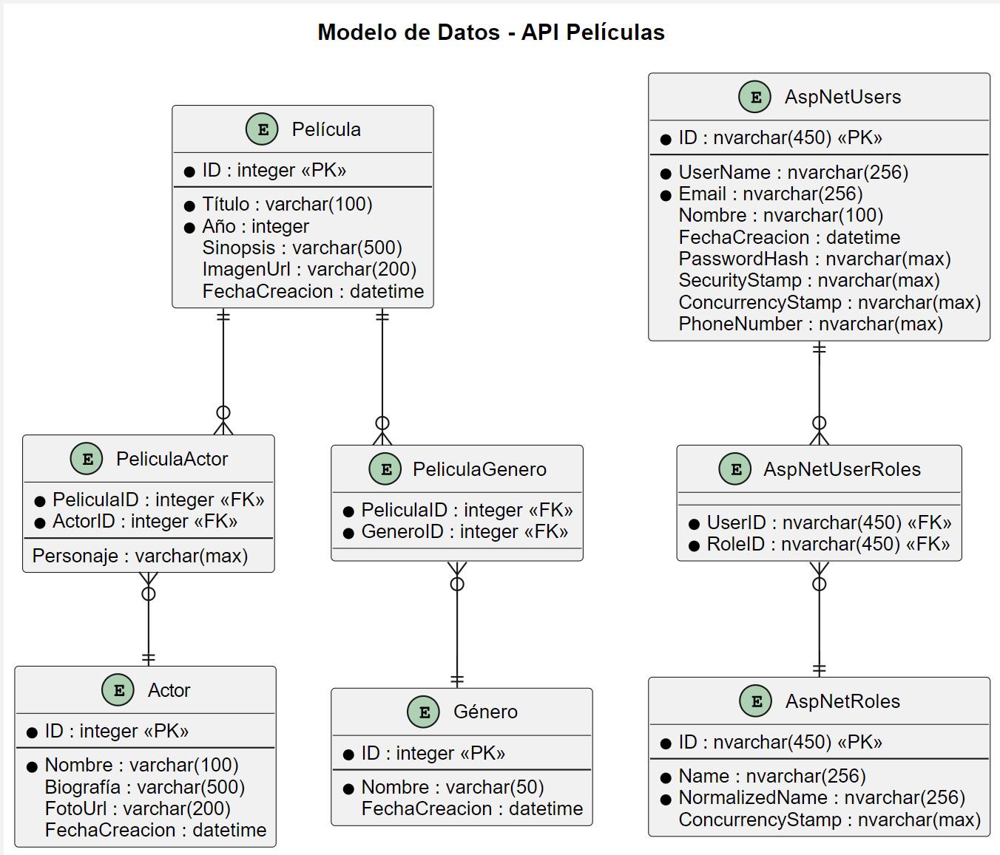

# BuscaPeli Application

## Description

This web application allows users to search for and display information about movies. Users can search by title, genre, or actor name, and view complete details of movies including their cast. The application has an authentication system for user and role management.

## Features

You can navigate into this solutions visit:
URL: http://clearmechanic.asociado.space/

- Search for movies by title, genre, or actor name

- Movie details page: Shows complete information about a selected movie

- Management of movies, genres, and actors (CRUD)

- User authentication and authorization system

- Association of movies with genres and actors

- Home page: Landing page with featured movies and search functionality

- Actor management: Displays actor biography and filmography


## Structure

The project is organized into:

- **BackEnd**: RESTful API developed in .NET Core 8.
  - [Repositorio backend](https://github.com/roco170a/buscapelis-back): https://github.com/roco170a/buscapelis-back

- **FrontEnd**: Client application developed with React, TypeScript, and Vite.
   - [Repositorio frontend](https://github.com/roco170a/buscapelis-front): https://github.com/roco170a/buscapelis-front

## Stack

### Backend
- .NET Core 8
- MS SQL Server / MS SQL Server Express
- Entity Framework Core
- ASP.NET Core Identity
- JWT for authentication

### Frontend
- React.js
- TypeScript
- Vite as bundler
- Bootstrap for CSS styles
- Environment variables for configuration

## Setup

### Requirements
- .NET Core 8 SDK
- Node.js (version 14 or higher)
- SQL Server / SQL Server Express

### DB Config
1. Create a SQL Server database
2. Configure the database user (appsettings.json), example:
   - User: usr_app_pelis
   - Password: 1*pruebas
   - Must have permissions for migrations


### Config Backend
1. Download the repository `pelis-back`
2. Edit the `appsettings.json` file with the correct database configuration
3. Run the migrations: `dotnet ef database update`
4. Start the API: `dotnet run`

### Config Frontend
1. Download the repository `pelis-front`
2. Install dependencies: `npm install`
3. Create `.env` file based on `.env.example` and configure the API URL
4. Start the application: `npm run dev`

## Config variables frontend
## Frontend Environment Variables

The frontend uses environment variables to configure different aspects of the application:

| Variable | Description | Default Value |
|----------|-------------|---------------|
| VITE_API_URL | API base URL | http://localhost:5278/api |

### Config files

The project includes several files to manage environment variables:

- `.env`: Variables for the local development environment
- `.env.example`: Example template for creating the `.env` file
- `.env.production`: Variables for the production environment

### Implementation

Environment variables are mainly used in:

- `src/utils/api.ts`: REST API base configuration
- `src/services/authService.ts`: Authentication services

To access an environment variable in the code:

```typescript
const apiUrl = import.meta.env.VITE_API_URL;
```

Note: In Vite, only variables that start with `VITE_` are exposed to the client code.

## Authentication and Authorization

Although GET queries do not require authentication, JWT (JSON Web Tokens) are applied to POST, PUT, and DELETE methods which are generated by the backend and used by the frontend for these types of requests.

## Endpoints 

You can navigate into this solutions section, visit:
URL: http://clearmechanic.asociado.space/web/swagger


### Películas
- `GET /api/Peliculas`: Get all movies
- `GET /api/Peliculas/{id}`: Get movie by ID
- `GET /api/Peliculas/buscar?criterioBusqueda={texto}`: Search movies by criteria
- `POST /api/Peliculas`: Create new movie
- `PUT /api/Peliculas/{id}`: Update movie
- `DELETE /api/Peliculas/{id}`: Delete movie

### Géneros
- `GET /api/Generos`: Get all genres
- `GET /api/Generos/{id}`: Get genre by ID
- `POST /api/Generos`: Create new genre
- `PUT /api/Generos/{id}`: Update genre
- `DELETE /api/Generos/{id}`: Delete genre

### Actores
- `GET /api/Actores`: Get all actors
- `GET /api/Actores/{id}`: Get actor by ID
- `POST /api/Actores`: Create new actor
- `PUT /api/Actores/{id}`: Update actor
- `DELETE /api/Actores/{id}`: Delete actor

### Usuarios
- `POST /api/Usuarios/registro`: Register new user
- `POST /api/Usuarios/login`: Login
- `GET /api/Usuarios/roles`: Get available roles

## Aditional features
## Additional Features

- Result pagination
- Centralized error handling
- Frontend and backend data validation
- Responsive interface adapted to mobile devices
- Display of movie and actor images

## Code conventions

- **Comments**: All comments in the code are in English, preceded by the initials "RCC".
- **Environment Variables**: Environment variables in the frontend start with the prefix "VITE_".
- **Naming**: camelCase is used for variables and methods, PascalCase for classes and interfaces.
- **Estructura de Archivos**: Organización modular por características y funcionalidades.
- **File Structure**: Modular organization by features and functionalities.

## Testing

The frontend includes unit tests for components using Vitest and React Testing Library. Tests verify that components render correctly and handle their props as expected.

### Running Tests


To run the tests:

```bash
# Run all tests
npm test

# Run tests in watch mode during development
npm run test:watch
```

### Test Structure

Tests are organized by component:

- `src/components/common/__tests__/` - Tests for common components
- `src/components/movies/__tests__/` - Tests for movie-related components

### Testing Strategy

The tests focus on:
- Component rendering verification
- Props handling
- User interaction (where applicable)

## Additional Documentation

For more details about the project's operation, consult the specific documentation in the `/Arquitectura` folder:

- **diagrama_aplicacion.puml**: General architecture diagram of the application

- **diagrama_tablas.puml**: Entity-relationship model of the database

- **datos_prueba.sql**: SQL script with test data for the application

- **wireframes**: sketches for previewing the principal idea
 


> Note: PUML files can be visualized with tools like [PlantUML](https://plantuml.com/) or extensions available for VS Code and other editors. 